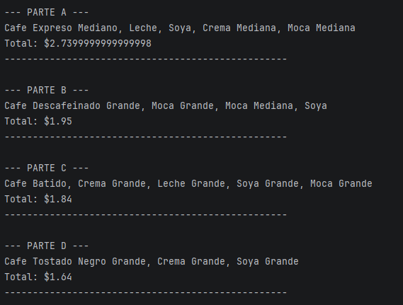

Para esta actividad como lo mencione en los commit que realice hice algo extendido la actividad pero puedo entendendr lo que hicey con esto los precios son precisos y ordenados y en el momento de ejecucion me da una descripcion ordenada y bien echa 
-
y asi quedaria la salida: 

